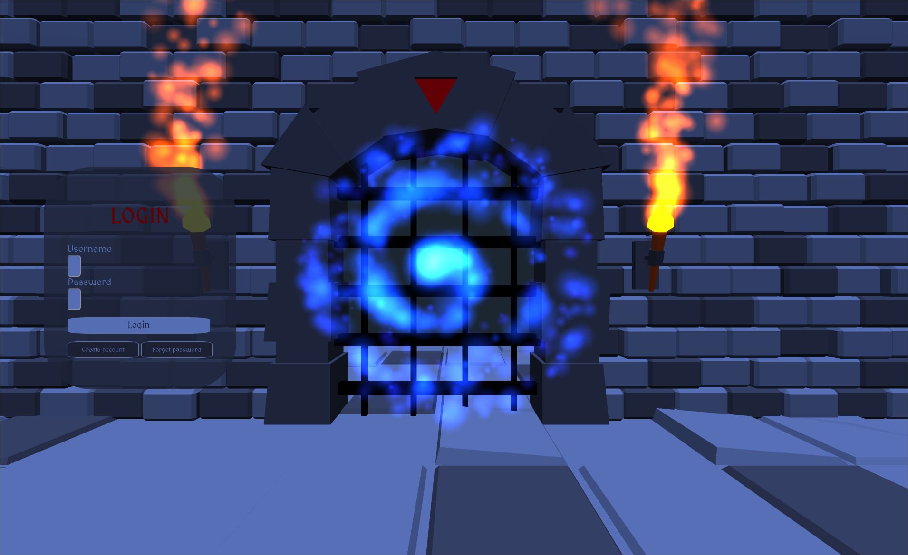

# The Perfect Login Screen

A fantasy-themed login screen: an HTML form overlaid on a 3D Three.js scene, with a dungeon gate, a swirling portal, and torch fire particle effects.



**Live demo:** https://perfect-login-screen.vercel.app

## Tech stack

- [Vite](https://vitejs.dev/) — dev server and bundler
- [Three.js](https://threejs.org/) — 3D scene, FBX dungeon model, lighting
- [three-nebula](https://three-nebula.org/) — fire and portal particle systems
- [hover.css](https://ianlunn.github.io/Hover/) — button hover animations
- [MedievalSharp](https://fonts.google.com/specimen/MedievalSharp) — Google font

## Getting started

```bash
npm install
npm run dev
```

## Build

```bash
npm run build
npm run preview
```
